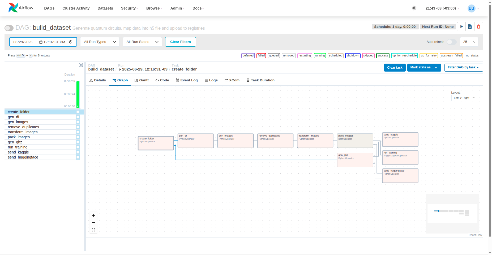
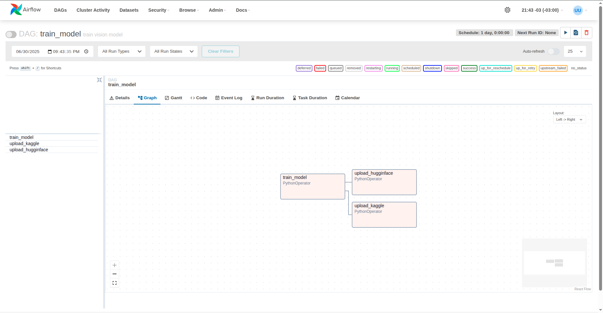

# QCOP

## In progress 🚧

This project, is a computer vision model based on RestNet trained to be able to predict the output of a quantum circuit.

To do this, Two Airflow pipelines were built. One to construct the dataset using Qiskit and then upload it to kaggle and huggingface, and the other one to get the dataset and train/evaluate the model.

The whole project was built in python with some helpers in bash and docker containers to pack the airflow instance as well as the postgres database used by it.

